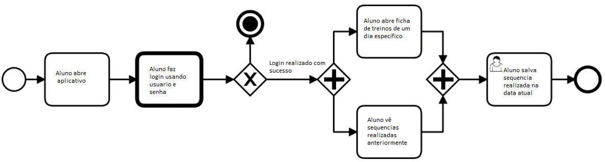
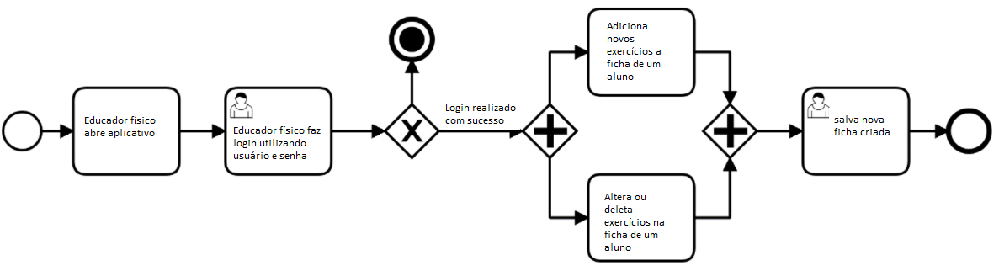
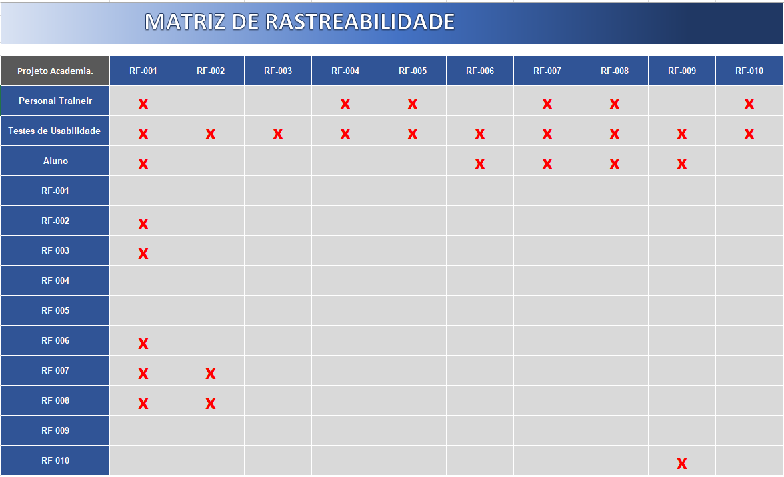
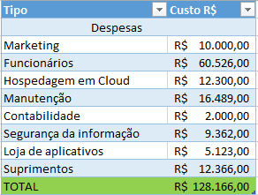

# Especificações do Projeto

Esse projeto tem como intenção o desenvolvimento dessa aplicação focando na necessidade de uma ferramenta que facilite a disponibilidade e o acesso dos planos de treinamento. Pensando nisso, foram criadas as seguintes personas e histo´rias de usuário para colaborar com o escopo deste projeto.

## Personas

|DESCRIÇÃO| MOTIVAÇÃO |FRUSTRAÇÃO|
|--------------------|------------------------------------|----------------------------------------|
|Profissional de Educação Física  | Disponibilizar o plano de exercícios físicos para os seus alunos e trocar fichas a cada alteração de exercícios de seus alunos | Dificuldade em editar fichas de treinos dos alunos.|
|Proprietária de academia       | Utilizar o aplicativo para otimizar o tempo dos professores e alunos da academia.| Gasto desnecessário em papel e alunas perdendo a ficha de treino de forma recorrente.|
|Aluna da academia | Utilizar o aplicativo para facilitar o treino na academia.| Perde a ficha de treinos ou estraga a ficha com suor|

## Histórias de Usuários

Com base na análise das personas forma identificadas as seguintes histórias de usuários:

|EU COMO... `PERSONA`| QUERO/PRECISO ... `FUNCIONALIDADE` |PARA ... `MOTIVO/VALOR`                 |
|--------------------|------------------------------------|----------------------------------------|
|Profissional de Educação Física  | Desejo editar rotinas de exercícios físicos para alunos sem precisar refazer no papel.| para melhorar a interatividade entre os alunos e eu. |
|Profissional de Educação Física       | Desejo disponibilizar os planos de exercícios físicos | Para otimizar os resultados dos meus alunos como o treino.|
|Proprietária de academia | Desejo otimizar o tempo dos prestadores de serviço na minha academia| Para melhorar a assistência de alunos  |
|Proprietária de academia| Desejo divulgar planos e serviços da academia| Para atingir os alunos da minha região de forma mais efetiva |
|Proprietária de academia| Desejo economizar papel e energia | Para reduzir custos com insumos |
|Aluna da academia       | Desejo facilitar o uso da minha ficha na academia| Para não perder fichas e perder tempo com o instrutor me auxiliando nos exercícios |

## Modelagem do Processo de Negócio 

### Análise da Situação Atual

O mercado de aplicativos têm aumentado o foco na área da saúde e hábitos de vida. A comunidade ligada aos exercícios físicos utiliza de uma ficha em papel para descrever o plano de treino realizado por alunos em ambientes como a academia, devido o objeto de instrução desses alunos ser o papel, percebemos a dificuldade ao utilizar esse material no ambiente da academia devido a rotina do serviço e de avarias como água e suor. 
Desta maneira, será desenvolvido uma aplicação com o intuito de salvar rotinas de treino, exercícios e dados relativos à musculação, considerando a dificuldade do uso de papéis em academias. Porém, é necessário contar com a importância do auxílio de um profissional habilitado para a elaboração do planejamento de rotina de treino do aluno com as particularidades de cada um, considerando os riscos de lesões e limitações de cada aluno.
Considerando isso, o objetivo da aplicação será desenvolver uma ferramenta mobile que auxilie o profissional de Educação Física a elaborar, editar e disponibilizar o programa de treino dos alunos, podendo ser utilizado em smartphones ou tablets, de maneira mais prática.
 

### Descrição Geral da Proposta

### Processo 1 – MANUSEANDO A FICHA DE TREINOS

### Processo 2 – SALVANDO/ALTERANDO/DELETANDO FICHA DE TREINOS

## Indicadores de Desempenho ***

|INDICADOR| OBJETIVO |DESCRIÇÃO - CÁLCULO|PERSPECTIVA|
|--------------------|------------------------------------|----------------------------------------|-------------------------------|
|IND1 |OBJ1 | DESC1| PERSP1|
|IND1 |OBJ1 | DESC1| PERSP1|
|IND1 |OBJ1 | DESC1| PERSP1|
|IND1 |OBJ1 | DESC1| PERSP1|

# Especificações do Projeto

Pré-requisitos: <a href="1-Documentação de Contexto.md"> Documentação de Contexto</a>
 </ol>
## Requisitos
<ol>
 Os requisitos funcionais e não funcionais foram definidos da seguinte maneira:

 ### Requisitos Funcionais
<ol> 
 Tabela 2 — Requisitos Funcionais

 |ID	|Descrição do Requisito	|Prioridade|
 |---|-----------------------|----------|
 |RF-001|	Cadastrar personal/alunos	   | ALTA|
 |RF-002| Fazer login no sistema      | ALTA|
 |RF-003|	Alterar dados da conta| ALTA|
 |RF-004|	Criar uma lista para cada aluno|BAIXA|
 |RF-005| Alterar dados da Lista.| ALTA|
 |RF-006| O Aluno possuir acesso a lista|	ALTA|
 |RF-007|	Editar dados Aluno/personal |	MÉDIA|
 |RF-008|	Excluir dados Aluno/personal|BAIXA|
 |RF-009| Marcar um treinamento como concluido|	BAIXA|
 |RF-010|	Gerar gráfico de avaliaçoes para o personal |	BAIXA|
 
 Fonte: Elaborado pelos autores (2022).
 
 obs: *CRUD: Criar, ler, atualizar e deletar (Create, Read, Update, Delete)

 </ol>

 ### Requisitos não Funcionais:
 <ol>
  
Tabela 3 – Requisitos não Funcionais
|ID	|Descrição do Requisito	|Prioridade|
|-------|------------------|---------|
|RNF-001|	O sistema será construído através arquitetura MVC| MÉDIA|
|RNF-002|	O sistema deve ser capaz de apresentar uma usabilidade intuitiva para o usuário| BAIXA|
|RNF-003|	O sistema deve ser capaz de tratar exceções e se recuperar de falhas sem que haja perda de dados|	ALTA|
|RNF-004|	O sistema vai utilizar React Native,PHP,SQL| ALTA|
|RNF-005|	Será utilizada a ferramenta MYSQL Workbench para desenvolvimento e administração de base de dados|	ALTA|
|RNF-006|	O sistema não poderá demorar mais de 4 segundos para carregar|	ALTA|

  Fonte: Elaborado pelos autores (2022).

 </ol>
</ol>

## Restrições
 
O projeto está restrito aos itens apresentados na tabela a seguir:
 
Tabela 4 – Restrições

|ID|	Restrição|
|--|----------|
|01|	Não funciona sem acesso a internet|
|02|	A aplicação terá compatibilidade com sistema Android|
|03|	Para acesso ao sistema é necessário acesso à internet estável e de boa qualidade de transmissão de dados|
|04| O projeto deverá ser entregue até o final do semestre|
|05|	Interação com o cliente**|
|06|	Deverá ser gerenciável|

Fonte: Elaborado pelos autores (2022).

</ol>

## Diagrama de Casos de Uso
<ol>
 O diagrama de casos de usos foi elaborado da seguinte maneira:
 
 ![(NOME) - Diagrama de caso de uso]
 
 
</ol>

## Matriz de Rastreabilidade
<ol>
 <figure>
    
</figure>

# Gerenciamento de Projeto ***

De acordo com o PMBoK v6 as dez áreas que constituem os pilares para gerenciar projetos, e que caracterizam a multidisciplinaridade envolvida, são: Integração, Escopo, Cronograma (Tempo), Custos, Qualidade, Recursos, Comunicações, Riscos, Aquisições, Partes Interessadas. Para desenvolver projetos um profissional deve se preocupar em gerenciar todas essas dez áreas. Elas se complementam e se relacionam, de tal forma que não se deve apenas examinar uma área de forma estanque. É preciso considerar, por exemplo, que as áreas de Escopo, Cronograma e Custos estão muito relacionadas. Assim, se eu amplio o escopo de um projeto eu posso afetar seu cronograma e seus custos.

## Gerenciamento de Tempo

Com diagramas bem organizados que permitem gerenciar o tempo nos projetos, o gerente de projetos agenda e coordena tarefas dentro de um projeto para estimar o tempo necessário de conclusão.

O gráfico de Gantt ou diagrama de Gantt também é uma ferramenta visual utilizada para controlar e gerenciar o cronograma de atividades de um projeto. Com ele, é possível listar tudo que precisa ser feito para colocar o projeto em prática, dividir em atividades e estimar o tempo necessário para executá-las.

## Gerenciamento de Equipe

O gerenciamento adequado de tarefas contribuirá para que o projeto alcance altos níveis de produtividade. Por isso, é fundamental que ocorra a gestão de tarefas e de pessoas, de modo que os times envolvidos no projeto possam ser facilmente gerenciados. 

## Gestão de Orçamento

 <ol>
 <figure>
    
</figure>
