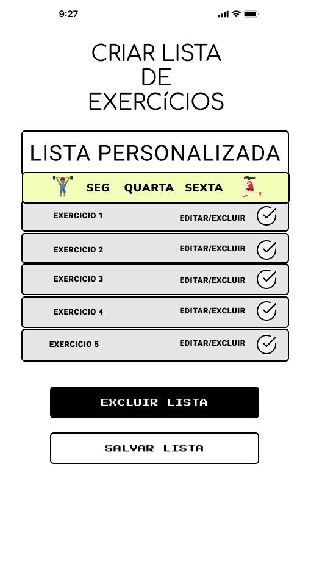

# Projeto de Interface
<ol>
O objetivo desse projeto e entregar aos seus usuários um guia pratico e interativo de uma variedade de empresas em sua regiao. Geralmente o usuário de um sistema operacional julga o produto pela interface criada pelo programador ao invés de sua finalidade desta forma se juga necessário a criação de um sistema que se venda na primeira olha do cliente. Desta forma foi elaborado fluxo de usuário que vem atender o tipo de cliente pré-estabelecido na Documentação de Especificação, criando uma padronização do projeto, com o foco na acessibilidade e usabilidade. 
Partindo dessa definição foi determinado uma interfaces se que melhor se adequaria a esse objetivo
 
## Diagrama de Fluxo
<ol>
 
O diagrama apresenta o estudo do fluxo de interação do usuário com o sistema interativo e  muitas vezes sem a necessidade do desenho do design das telas da interface. Isso permite que o design das interações seja bem planejado e gere impacto na qualidade no design do wireframe interativo que será desenvolvido logo em seguida.

O diagrama de fluxo pode ser desenvolvido com “boxes” que possuem internamente a indicação dos principais elementos de interface - tais como menus e acessos - e funcionalidades, tais como editar, pesquisar, filtrar, configurar - e a conexão entre esses boxes a partir do processo de interação. Você pode ver mais explicações e exemplos https://www.lucidchart.com/blog/how-to-make-a-user-flow-diagram.

## Diagrama de Fluxo
<figure>
  
  <figcaption>Diagrama de Fluxo</figcaption>
</figure>

 Figura 02- Diagrama de Classe
 </ol>

## Diagrama de Classe

## User Flow
<ol>
 
Fluxo de usuário (User Flow) é uma técnica que permite ao desenvolvedor mapear todo fluxo de telas do site ou app. Essa técnica funciona para alinhar os caminhos e as possíveis ações que o usuário pode fazer junto com os membros de sua equipe.

<figure>
  
  <figcaption>User flow</figcaption>
</figure>

 </ol>

## Wireframes
<ol>
 
 Conforme o diagrama de fluxo do projeto, apresentado no item anterior, as telas do sistema são apresentadas em detalhes nos itens que se seguem. Para visualizar o wireframe interativo, acesse o ambiente Figma do Projeto
 
 ### Tela de Login
  <ol>
 
   A primeira tela a ser exibida pelo programa e a tela de login, tratasse de uma tela formulário simples que encaminhará o usuário às demais telas conforme o preenchimento da mesma. Sendo essa exemplificada à baixo:
   
   <figure>
    
   </figure>

   Figura 05- Tela de Login
   * Usuário cadastrado irá direcionado à tela inicial do usuário, a ondo o mesmo terá acesso a seus dados. 
   * Ao clicar em cadastro o usurário será encaminhado a tela com o formulário de cadastro
 </ol>
  
  ### Tela de Cadastro
  <ol>
  Na “figura 06-tela de cadastro” à baixo a tela de cadastro de usurário, contendo ela um formulário com o campos a serem preenchidos com os dados básicos do usuário, como senha,email e etc: 
   
  <figure>
    
    
</figure>
 
  
   Figura 06- Tela de Cadastro
   * Nesta tela o usuário irá realizar um cadastro básico para que apenas o mesmo tenha acesso ao sistema 
 </ol>
 
 ### Tela Inicial
 <ol>
  Na tela de inicial, o usuário terá acesso aos serviços do sistema que serão divididos em blocos sendo eles abaixo especificado:
  
<figure>
    <figcaption>Cadastrar Alunos</figcaption>
    
</figure>
 
  Figura 07- Tela Inicial.
  * Cadastrar um aluno para ter acesso ao sistema.
  * Conseguir efetuar futuramente o envio da lista de treino.
 </ol>
 
 ### Tela Criar Listas de Treino.
 <ol>
  
  Através da tela;
  O usuário conseguira criar as demais listas de treino personalizado para os alunos registrados no sistema.
  
<figure>
    <figcaption>Cadastrar Alunos</figcaption>
    
</figure>
 </ol>
 
 ### Tela de configuração de (Alunos/Listas)

 <ol>
  Uma tela de configuracao para editar o Perfil do Aluno 
  desejado e também para realizar alterações nas listas de 
  exercícios.
<figure>
    <figcaption>Update Alunos/Listas</figcaption>
    
</figure>
  </ol>
 </ol>
