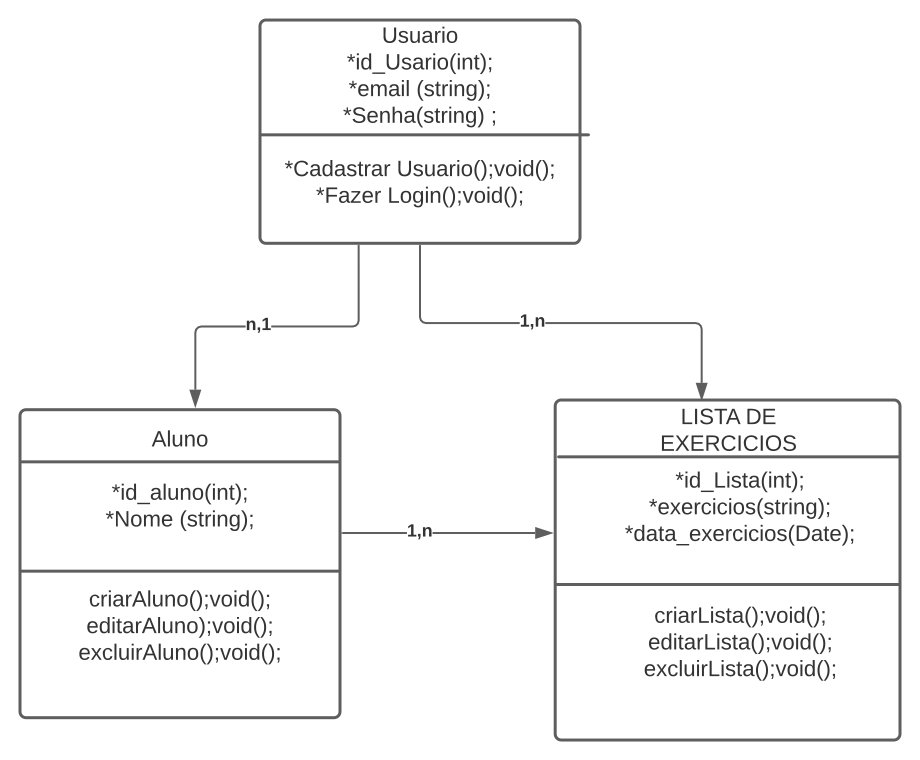
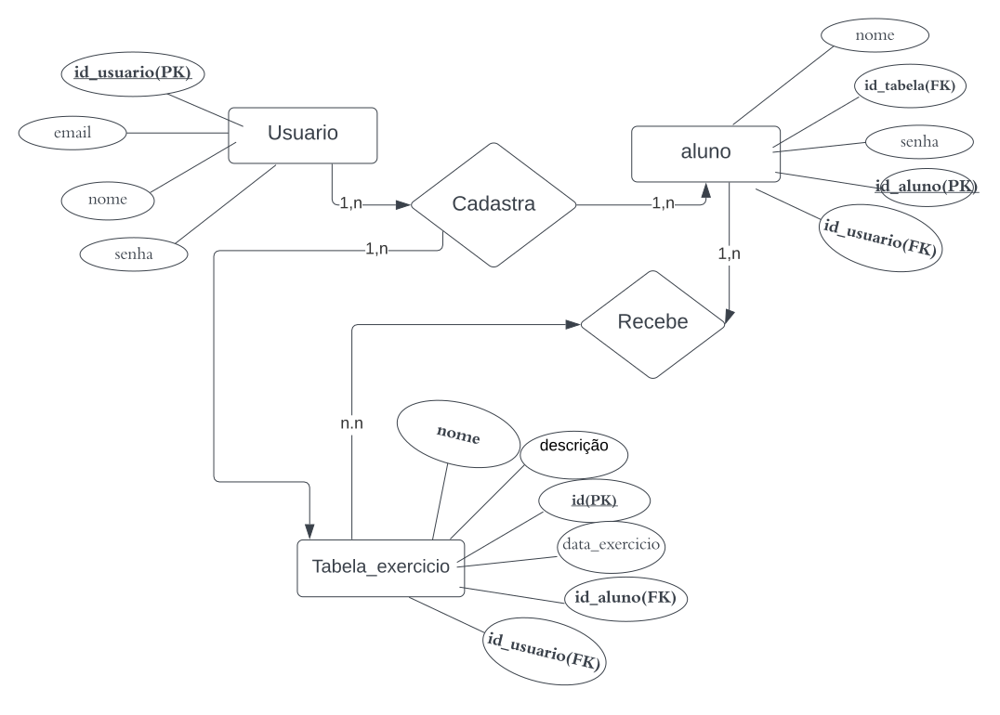
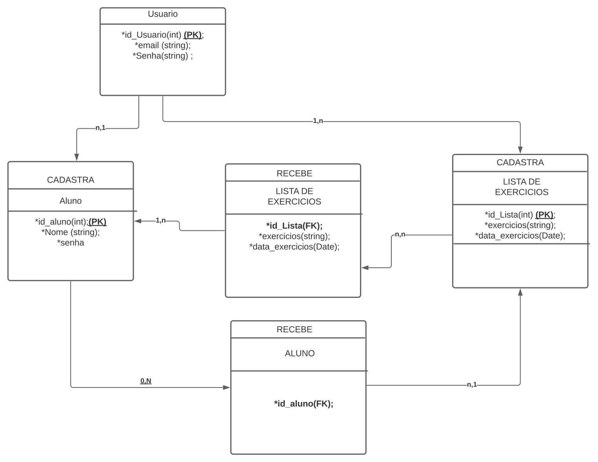

# Arquitetura da Solução

## Diagrama de Classes

<ol>
 O diagrama de classes ilustra graficamente como será a estrutura do software, e como cada uma das classes da sua estrutura estarão interligadas. Essas classes servem de modelo para materializar os objetos que executarão na memória.

 <figure>
    
</figure>

 Figura 13- Diagrama de Classes
</ol>

## Modelo ER

O Modelo ER representa através de um diagrama como as entidades (coisas, objetos) se relacionam entre si na aplicação interativa.]

Figura 14- Modelo RE
<figure>
    
</figure>

## Esquema Relacional

O Esquema Relacional corresponde à representação dos dados em tabelas juntamente com as restrições de integridade e chave primária.

<figure>
    
</figure>

Figura 15- Esquema Relacional

## Tecnologias Utilizadas

<ol>
 Para o desenvolvimento do sistema utilizaremos a linguagem Ecma script , juntamente com o framework react-native, sera utilizada a ferramenta para desenvolvimento e para PHP/MYSQLWORKBENCH  administração de base de dados, além de ser sistema construído através da arquitetura MVC, tendo sua hospedarem no Horuku, acessado de um navegador padrão, como ferramentas adicionais como o Github como ferramenta de repositório do código fonte, e o Visual Studio como ferramenta de suporte ao desenvolvimento, Figma para os projetos de interfaces e Teamplates.
 </ol>

## Hospedagem

Esse projeto após seu termino será lançado na plataforma de hospedagem , e terá como endereço de URL:(URL)

## Modelo Físico

https://www.mediafire.com/file/dbbqmg5vxtbd1oy/BD_database.sql/file

## Qualidade de Software

Conceituar qualidade de fato é uma tarefa complexa, mas ela pode ser vista como um método gerencial que através de procedimentos disseminados por toda a organização, busca garantir um produto final que satisfaça às expectativas dos stakeholders.

No contexto de desenvolvimento de software, qualidade pode ser entendida como um conjunto de características a serem satisfeitas, de modo que o produto de software atenda às necessidades de seus usuários. Entretanto, tal nível de satisfação nem sempre é alcançado de forma espontânea, devendo ser continuamente construído. Assim, a qualidade do produto depende fortemente do seu respectivo processo de desenvolvimento.

A norma internacional ISO/IEC 25010, que é uma atualização da ISO/IEC 9126, define oito características e 30 subcaracterísticas de qualidade para produtos de software.
Com base nessas características e nas respectivas sub-características, identifique as sub-características que sua equipe utilizará como base para nortear o desenvolvimento do projeto de software considerando-se alguns aspectos simples de qualidade. Justifique as subcaracterísticas escolhidas pelo time e elenque as métricas que permitirão a equipe avaliar os objetos de interesse.

> **Links Úteis**:
>
> - [ISO/IEC 25010:2011 - Systems and software engineering — Systems and software Quality Requirements and Evaluation (SQuaRE) — System and software quality models](https://www.iso.org/standard/35733.html/)
> - [Análise sobre a ISO 9126 – NBR 13596](https://www.tiespecialistas.com.br/analise-sobre-iso-9126-nbr-13596/)
> - [Qualidade de Software - Engenharia de Software 29](https://www.devmedia.com.br/qualidade-de-software-engenharia-de-software-29/18209/)
